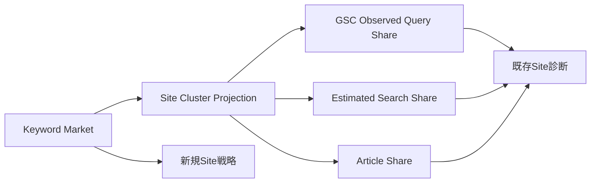

# Keyword Market・Site Share・戦略／診断Report 画面検証仕様

## 1. 目的

本書は、「Keywordは市場を表し、記事と実際のQueryはSiteが市場のどこを獲得しているかを表す」という業務意味を、新規Site戦略Reportと既存Site診断Reportの画面で検証するpre-L3仕様である。

Reportは分析結果を読むだけの資料ではない。MarketからSite Share、記事・Query、月次計画、Recommendationへ進む業務判断面である。画面検証で章立て、情報密度、操作粒度、用語の不足・過剰が判明した場合はL1/L2へ戻し、L3のread modelやUI構成を先に固定しない。

## 2. 固定する分析意味

### 2.1 基本単位

- Reportの基本単位は単一KeywordではなくSite Clusterである。Site Clusterは、どのカテゴリー／テーマ領域をSiteで持ち、代表・補助Keywordと記事群をどの役割・順序・内部linkで配置するかというカテゴリー／テーマ戦略単位として扱う。
- Clusterは代表Keywordと複数の補助Keyword、検索Intent、ファネル、業界／業種、商品、顧客、地域、横断軸を持つ。
- 補助Keyword数を固定せず、主従関係とSERP／Intent根拠を表示する。主Keywordだけを見て記事を作らない。
- 個別Keyword、GSC Query、記事割当をCluster詳細から失わず、集計値だけへ畳み込まない。
- 画面では`カテゴリー／テーマ戦略`を第一候補の平易なラベルとして検証し、内部keyのClusterを理解必須にしない。WordPress等のCMS categoryとは1対1に固定せず、現行構造への記事割当と構造提案を分ける。

### 2.2 MarketとShare

| 成分 | 意味 | 主な入力 | 混ぜてはいけないもの |
|---|---|---|---|
| Keyword Market | Siteの外側に存在する検索需要・領域・圧力 | 公共Keyword、検索量、SERP、競争性、季節性、AIO、広告 | 顧客Siteの順位・click・CV |
| Observed Query Share | GSCで実際に観測できたSiteの獲得範囲 | Query、表示、click、順位、CTR | 市場全体、未観測Query |
| Estimated Search Share | 外部順位・CTR等から推定した補助範囲 | SERP順位、期待CTR、競合推定 | 実測値、保証値 |
| Article Share | Cluster内で記事が担うQuery・流入・CVの分布 | Article Summary、割当、GSC、CV集計 | 市場需要そのもの |

Observed、Estimated、Article Shareを一つの「シェア率」へ合算しない。各値に期間、Source、availability、confidence、計算versionを表示する。

### 2.3 AIO・広告・信用性

- AIOとリスティングはMarket／SERP圧力として、期待clickの割引、表示面占有、価値判断の一成分に使う。
- AIO観測不可を0%と表示せず`未観測`とする。
- AIOへの表示・引用、AI crawler取得性は後続構想の別観測であり、初期Keyword Reportで測定済みと偽らない。
- Domain信用性はKeyword価値のSite適合成分であり、一般市場の需要値へ混ぜない。
- 総合scoreだけを見せず、市場需要、実現可能性、AIO／広告圧力、信用適合、Intent／CV近接、Site必要性を分けて説明する。

## 3. 新規Site Keyword戦略Report

実績がないSiteに、順位、click、CVの不足を異常として表示しない。どの市場領域をどの順で記事資産へ変えるかを決める。

| 章 | 判断すること | 主な表示 |
|---|---|---|
| 市場概要 | どの需要と圧力があるか | 需要、traffic potential、季節性、競争性、AIO、広告、観測範囲 |
| Market Map | どのカテゴリー／テーマ戦略を持つか | 業界／業種、商品、顧客、ファネル、地域、横断軸別のテーマ領域 |
| Site適合 | 自Siteが扱うべきか | Site必要性、流入機会、CV機会、記事成立性、信用適合 |
| 優先Cluster | 何から扱うか | 代表＋補助Keyword、Intent、記事目的、期待役割、不足入力 |
| 構造提案 | カテゴリー／テーマ戦略を現行Siteへどう配置するか | 推奨カテゴリと記事配置。カテゴリー／テーマ戦略＝CMS categoryとはせず、CMS構造は自動変更しない |
| 制作順 | どの順で作るか | 前提記事、内部link前後関係、依存、月次の傾向配分 |
| 推薦準備 | 次に何が実行可能か | 実行可能、入力待ち、観測、除外、予測Credit |

数値成果予測は実績条件を満たさないため表示しない。方向性、相対優先、範囲、confidenceを示し、達成可能性または順位保証と表現しない。

## 4. 既存Site Keyword診断Report

既存Siteも同じKeyword Marketを基線にする。記事一覧やGSC獲得Queryだけから診断を始めず、Market→Cluster→Share→記事／Queryの順で掘る。

| 章 | 判断すること | 主な表示 |
|---|---|---|
| 市場と対象範囲 | 何を母集団にしたか | Market version、期間、Source coverage、未観測領域 |
| Cluster別Share | Siteがどこを獲得しているか | Observed／Estimated／Article Shareを別表示 |
| 獲得Keyword | 正しく順位を獲得しているか | 主＋補助Keyword、Query、担当記事、順位、表示、click、CV、記事目的 |
| 未獲得・未配置 | 何が足りないか | 市場に存在する未獲得、記事未割当、成立性不足、ユーザー除外 |
| 資産状態 | 守る／伸ばす／直す対象は何か | protected、winning、quick win、weak、missing、untapped、emerging、declining、lost |
| 診断 | 原因は何か | Query Drift、カニバリ、index、click不足、CV接続、内部link、CTA |
| 外部要因 | 記事以外の変化か | 季節性、需要、AIO、広告、SERP構成、競合変化 |
| 施策配分 | 何を行うか | 新規、リライト、CTA／link Patch、保護、監視、ユーザー対応、見送り |
| 月次実行順 | いつ行うか | 依存、週次上限、予算、ユーザー予定との関係 |

- 順位なしはindex状態の確認前に記事失敗と断定しない。
- CVなしは通常に起こり得るため、それだけで異常または失敗にしない。記事目的、Intent、母数を併記する。
- 主Keywordだけでなく、割り当てたKeyword集合が意図どおり順位を得ているかを評価する。
- 想定した補助Keywordが主な獲得語になった場合、単純な主従入替えを自動実行せず、業界／Site実績から分類ロジックを再計算し補正候補を作る。

## 5. 画面案の比較

### 5.1 案A — 判断Story＋Cluster Explorer（第一検証案）

通常ビューは、`市場の全体像 → Siteの機会／現状 → 優先Cluster → 施策配分 → 次の行動`のStoryで要点を提示する。各章からCluster Explorerへ掘り、同じCluster ContextでMarket、Share、Keyword、記事、Recommendationを切り替える。

経営者・非専門者が結論を理解しやすく、Officeでは同じClusterの根拠、式、Source、Query、記事、履歴を専門的に掘れる。

### 5.2 案B — Cluster Matrix起点（比較案）

最初にCluster行、Market、Observed、Estimated、Article Share、状態、優先、推奨施策を横並びにし、filter／sortから詳細へ進む。比較・監査には強いが、初見利用者が「何を決めればよいか」を見失う可能性がある。

通常ビューを案A、Officeを案B中心にしつつ、どちらからも同じ対象へ往復できる組合せも比較する。

## 6. Cluster操作と再計算

通常ビューの基本操作はCluster単位の`優先 / 通常 / 保留 / 除外`とする。大量の個別Keyword承認を要求しない。変更前に、未実行Recommendation、月次配分、予測Credit、依存への影響を表示する。

Officeでは個別Keyword、Source、分類、代表語、主従、記事割当、業界／横断軸を詳しく確認し、許可された変更を型付きProposalとして作る。

- ユーザー確定分類を自動推定で上書きしない。
- ユーザー修正はSite固有補正へ反映し、匿名全体補正候補とは分離する。
- 実行済み施策と使用Report versionを維持し、未実行Recommendationと次回配分だけを再計算する。
- Site固有補正が順位へ悪影響を及ぼし得る変更は自動適用せず承認を取る。
- `recommendation_feedback`をCluster分類、除外、優先度変更の正本にしない。

## 7. 予測の段階解放

- 直近1か月のSite clickが1,000以上でも、対象Cluster／記事の入力が不足する場合は部分的に予測不可とする。
- 予測可能なCluster／記事数と、データ不足で予測できない対象数を分けて表示する。
- 予測値は実績に基づく参考範囲であり、達成保証ではない。
- 新規Siteや条件未達では数値をぼかして課金誘導するのではなく、利用可能条件と不足データを示す。Planによる表示制限はデータ不足と別理由にする。

## 8. 必須fixture

| Fixture | 条件 | 期待する画面 | 禁止する表示・動作 |
|---|---|---|---|
| KWR-UI-01 新規実績なし | GSC／記事なし | 市場・適合・制作順を表示 | 順位／click／CV異常 |
| KWR-UI-02 新規複数業界 | 複数業界＋横断軸 | カテゴリー／テーマ戦略の優先順と自動配分根拠 | 割合手入力の強制 |
| KWR-UI-03 既存市場基線 | GSC獲得語は市場の一部 | 公共Marketと未獲得を表示 | GSC集合＝市場全体 |
| KWR-UI-04 Observed only | 外部推定不可 | Observedとunknownを表示 | Estimatedを0または実測扱い |
| KWR-UI-05 Estimated only | GSCなし、外部推定あり | 推定・confidenceを明示 | 顧客実績として表示 |
| KWR-UI-06 三Share不一致 | Observed高、Estimated低、Article分散 | 三成分を別に比較 | 単一平均シェア |
| KWR-UI-07 AIO未観測 | AIO Source unavailable | 未観測と価値計算影響 | AIO 0% |
| KWR-UI-08 広告圧力高 | 広告占有が高い | Market圧力と期待click割引 | Keywordを自動除外 |
| KWR-UI-09 主＋補助獲得 | 主1＋補助複数が順位獲得 | 集合と担当記事を表示 | 主Keywordだけで成功判定 |
| KWR-UI-10 想定外語が優勢 | 補助語が主要流入 | 再計算・補正候補 | 自動主従入替え |
| KWR-UI-11 順位なし | index状態不明 | index確認とavailability | 記事失敗／即リライト |
| KWR-UI-12 CVなし | Know Intent、十分な表示 | 認知／Cluster充足の役割 | CV失敗 |
| KWR-UI-13 カニバリ疑い | SERP重複高・同一Intent | evidence付き提案 | SERP重複だけで確定・削除 |
| KWR-UI-14 部分Report | Cluster 40%分析済み | coverageと利用可能領域 | 全体Report完成表示 |
| KWR-UI-15 Cluster優先変更 | 未実行Recommendationあり | 影響差分後に新version | 実行済み施策の書換え |
| KWR-UI-16 個別Keyword修正 | ユーザーが分類修正 | Site補正とglobal候補を分離 | 自動推定で再上書き |
| KWR-UI-17 予測一部可 | Site 1,000 click超、一部不足 | 予測可能数／不可数を分離 | 全Site一括lock／unlock |
| KWR-UI-18 Office往復 | 通常StoryからCluster詳細へ | 同じReport／Cluster version | Officeで別計算 |
| KWR-UI-19 カテゴリー／テーマ配置 | 1つのカテゴリー／テーマ戦略が複数CMS categoryへまたがる | 記事群・役割・linkと現行構造割当を分離表示 | Cluster＝CMS categoryの強制 |

## 9. 判定基準

- 非専門者がMarketとSite Shareの違いを説明できる。
- 新規Site Reportと既存Site Reportを、単なる数値差し替えではなく別の判断資料として理解できる。
- カテゴリー／テーマ戦略を基本単位にしながら、個別Keyword、Query、記事、Source、現行CMS構造への割当へ掘り下げられる。
- Observed、Estimated、Article Share、AIO／広告圧力、Domain信用適合を混同しない。
- ReportからCluster調整、月次計画、Recommendationへ同じversionとfilterで進める。
- 通常ビューでは判断Story、Officeでは専門Matrix／Graphを扱い、同じProjectionを共有する。
- 部分開放、unknown、予測不可を0または失敗へ丸めない。

## 10. Findingの還流

検証結果は`SF-UI-06`へ、Report種別、利用者区分、理解できなかった概念、必要だった比較、過剰だった指標、操作粒度、Context喪失として記録する。意味変更が必要なら`REQ-BUS-02/04/05`、`REQ-SCREEN-09/18`、`REQ-KRL-*`、KeywordReport／MarketShareSnapshotへ先に反映する。

分類別L1を現行要求の正本とし、画面案は検証入力である。ブラウザ操作前は`open`とし、静的文書だけで`validated`またはL3確定済みにしない。

## 11. 参照正本

- `categories/business-requirements_v1.md` REQ-BUS-02・04・05
- `categories/screen-operation-requirements_v1.md` REQ-SCREEN-09・18
- `logic/keyword-portfolio-diagnostics-logic-requirements_v1.md`
- `ai-office-de-seo-keyword-market-share-connection-map_v1.md`
- `ai-office-de-seo-keyword-report-connection-map_v1.md`
- `ai-office-de-seo-domain-model_v3.7.md` KeywordReport / MarketShareSnapshot
