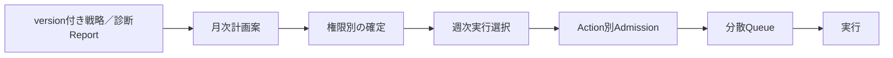

# 月次計画・週次実行選択 画面検証仕様

## 1. 目的

カテゴリー／テーマ戦略を、限られたcredit、処理Capacity、依存関係、保護条件の中で月次計画と週次実行予定へ変換する画面意味を検証する。計画は成果保証でも固定記事本数でもなく、目的へ向けたリソース配分である。計画確定、一括確認、実行Admission、実際のJob開始を同じ状態へ丸めない。

## 2. 固定する業務意味

- 月次目的は単純選択とし、記事・施策の配分率はシステムが計算する。実績不足時は達成確率を捏造せず、配置傾向と参考レンジを表示する。
- 配分単位はカテゴリー／テーマ戦略、新規記事、リライト、内部link、CTA、保護、監視等である。CMS categoryを自動変更する計画ではない。
- 作成可能量はcreditだけでなく、品質、週次枠、Site規模、処理種別、Provider／CMS、プラットフォームCapacityから算出する。追加creditは安全上限を解除しない。
- 計画確定は、全項目の同時起動、自動運用委任、CMS公開承認を意味しない。
- 週次一括確認後もAction単位で権限、credit reserve、依存、保護、接続、CapacityをAdmissionする。一部保留でも他の適格Actionは進められる。
- ユーザー指定作業はシステム都合で削除しない。依存順、内部link機会、予算・Capacity影響を提示し、指定どおり／推奨順／保留を選ばせる。

## 3. 権限と編集境界

| 項目 | 変更に必要な権限 | 他の利用者に見せる状態 |
|---|---|---|
| Site目的、KPI、月次方針、計画確定 | 目標管理 | 閲覧、変更案、権限者へ依頼 |
| カテゴリー／テーマ戦略の優先度、推薦方針 | キーワード・サイト戦略 | 閲覧、変更案 |
| Site予算・credit配賦 | 契約者またはサイトオーナー | 利用可能枠と不足理由。契約金額は契約者だけ |
| 個別施策の採用・制作開始 | Actionに対応する業務権限 | 閲覧、権限者へ依頼 |
| 自動運用の予算上限・委任operation | 契約者またはサイトオーナー | 有効範囲、停止理由、残枠 |

一つの「計画を確定」操作が、操作者にない予算配賦権限や戦略変更権限を代行してはならない。複数権限が必要な案は、確定済み部分、確認待ち部分、既存値を維持する部分を分けて表示する。

## 4. 通常ビュー案

### 案A: 判断サマリー＋権限別セクション

S1プランニングに「今月の目的」「カテゴリー／テーマ戦略の重点」「施策構成」「利用可能量」「今週の予定」「確認待ち」を順に置く。一般利用者には原因を業務語で示し、queue、worker、rate limit等の内部設定を出さない。

### 案B: 月間配置ボード

週列へ施策カードを配置し、依存、保護、credit、Capacity待ちを記号化する。ドラッグ操作だけを正本にせず、変更案、影響Preview、確定Commandを経由する。記事本数が固定保証に見えないよう、見込み幅と再評価日を表示する。

通常ビューで比較する問いは、案を30秒以内に理解できるか、誰の確認待ちか分かるか、待機を障害と誤認しないか、計画確定と公開を混同しないかである。

## 5. Agent Office案

Officeは同じMonthly Plan／Weekly Selection Projectionを使い、カテゴリー／テーマ戦略ごとの根拠、候補Action、依存graph、実績、予測credit、Capacity窓、見送られた候補を詳細表示する。優先順、対象外、品質、実行順、停止条件の変更は選択式または型付きProposalとし、共通Authorization／Commandへ接続する。Office独自の計画、予算、実行queueを作らない。

LLMは自由記述を構造化Proposalへ変換する場合に限定し、並べ替え、除外、品質選択、期間選択、影響再計算は決定論UIで行う。

## 6. S1・S3・S4の責務

| 画面 | 正本責務 |
|---|---|
| S1 プランニング | 月次目的、カテゴリー／テーマ戦略、施策配分、予算配分、週次選択、実績乖離 |
| S3 カレンダー | S1で確定した生成・施策予定とS4の公開予約を時間軸で参照する。戦略配分変更はS1へ戻す |
| S4 オートメーション | CMS下書き・公開予約、自動運用委任、利用上限、停止・再開。月次目的を再定義しない |

## 7. 検証fixture

| ID | 条件 | 期待表示・操作 | 禁止する誤解 |
|---|---|---|---|
| PLAN-UI-01 | 手動運用・計画案完成 | 差分確認後に目標管理権限者が確定 | Report完成だけで自動確定 |
| PLAN-UI-02 | 自動運用・期限まで変更なし | 計画versionを自動確定 | 全Actionを同時起動 |
| PLAN-UI-03 | 目標管理あり、予算配賦なし | 方針を確定し予算は確認待ち | 予算を暗黙変更 |
| PLAN-UI-04 | サイトオーナー、目標管理なし | 予算枠だけ変更可能 | KPI・方針も変更可能 |
| PLAN-UI-05 | 複数カテゴリー／テーマ | 優先順と自動配分根拠を表示 | 手入力比率を必須化 |
| PLAN-UI-06 | 実績不足 | 傾向配分・予測不可を表示 | 達成見込みを捏造 |
| PLAN-UI-07 | 品質を上げる | credit消費増と実行可能量減を再計算 | 固定記事数を維持 |
| PLAN-UI-08 | 週次Capacity不足 | 分散配置、次窓、概算見込みを表示 | 全件失敗または一斉起動 |
| PLAN-UI-09 | Provider／CMSが混雑 | 対象Actionだけ待機、他は継続 | Site全体停止 |
| PLAN-UI-10 | 依存する内部link記事あり | 推奨順と効果を相談表示 | ユーザー指定を自動削除 |
| PLAN-UI-11 | 3位以内保護対象 | 保護／監視へ振替理由を表示 | 改善枠だから無条件実行 |
| PLAN-UI-12 | 週次一括確認 | Action別Admission結果を表示 | 合計だけでreserve・実行 |
| PLAN-UI-13 | 一部credit不足 | 適格分と保留分を分離 | Batch全体を失敗扱い |
| PLAN-UI-14 | Report version更新 | 未実行分だけ再提案、実行済み履歴維持 | 過去計画を上書き |
| PLAN-UI-15 | 月途中で目的変更 | 新Plan versionと差分を表示 | 実行済み施策を再帰属 |
| PLAN-UI-16 | 自動計画確定・委任なし | 実行前に委任不足で保留 | 自動確定を自動運用同意扱い |
| PLAN-UI-17 | S3で計画順を変更 | S1 Planning Contextへ遷移 | S4で月次方針を変更 |
| PLAN-UI-18 | S3で公開予約を変更 | S4予約Contextへ遷移 | S1でCMS副作用を直接変更 |

## 8. Finding記録

検証結果は`SF-UI-07`へ記録する。意味変更は`REQ-BUS-03/05`、`REQ-SCREEN-01/18`、Authorization Operation Matrix、Monthly Plan／Weekly Execution Selection、Capacity Admissionへ先に戻す。ブラウザ操作前は`open`とし、静的文書だけで`validated`にしない。

