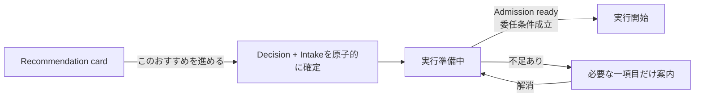
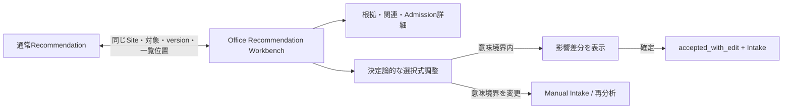

# Recommendation採用・調整 画面検証仕様

## 1. 目的と境界

本書はL3実装詳細ではない。L1/L2で定義したRecommendation Decision、Intake、Execution Admissionの意味が、SEOに詳しくない利用者向けの通常ビューと、詳しく確認・調整したい利用者向けのOfficeビューで成立するかを、操作可能な画面案とfixtureで検証する。

画面検証で不足・過剰・責務ずれが見つかった場合は、先にL1/L2を改版する。その結果からAPI、DDL、Event、Configを確定するため、本書のModal数、Panel配置、文言、調整候補をL3確定値として実装しない。

## 2. 画面案を問わず固定する意味

| 固定境界 | 画面で守ること |
|---|---|
| 判断対象 | Decision Eligibilityを固定した`presented` Recommendationの`recommendation_id + version`だけを判断対象にする。閲覧やView切替で別versionを作らない |
| 判断結果 | `採用 / 条件を調整して採用 / 保留 / 除外`を、それぞれ正規Decisionへ接続する。UI上のclickや既読をDecisionにしない |
| 原子性 | `accepted / accepted_with_edit`のDecisionとfreeze済みIntakeを同時成立させる。採用後に目的、対象、根拠等を再入力させない |
| 採用と実行 | 採用は施策を実行候補として確定する行為であり、実行開始そのものではない。実行可否は後続のExecution Admissionが判定する |
| 実行開始 | Admissionが`ready`で、必要な委任・承認条件も成立した場合だけ一度consumeして正規Actionへdispatchする。画面遷移やtoastだけで実行開始と表示しない |
| 不足時 | 入力、権限、Plan、Credit、接続、Capacity、保護等の不足はAdmission側へ保持し、採用を不採用へ書き換えない |
| 二つのView | 通常ビューとOfficeビューは同じProjection、Authorization、Command、Decision、Intakeを使う。Office専用の裏状態や権限迂回を作らない |
| 計算責務 | 見積、実行可能性、残高、Gate結果をClientやLLMで再計算せず、version付きServer Projectionを表示する |
| 意味変更 | type、対象、主目的、Keyword Cluster、Action routeを変える編集は`accepted_with_edit`にしない。元推薦を参照するManual Intakeまたは再分析へ分ける |
| LLM利用 | 選択肢、状態表示、影響差分、Admission判定にLLMを使わない。自由文の意図整理等、意味解釈が必要な場合だけ別途Agent Interactionへ渡す |

## 3. 通常ビューの比較案

### 3.1 案A — 状態遷移を隠さない一操作型（第一検証案）

Recommendation cardには、対象、推奨施策、なぜ今行うか、期待する役割、予測Credit、不足入力、現在の実行可能状態だけを表示する。主操作は`このおすすめを進める`、副操作は`条件を調整`、`保留`、`除外`とする。

- 条件が揃い、現在の運用設定で実行可能なら、不要な再確認Modalを挟まず`実行準備中 → 実行開始`へ進める。
- 不足がある場合だけ、`入力を追加`、`Creditを確認`、`CMSを再接続`、`権限者へ依頼`等の解消操作を一つのprimary CTAとして出す。
- 状態表示は`採用しました`で止めず、`実行準備中 / 入力が必要 / Creditが必要 / 接続確認 / 実行待ち / 実行開始`を同じcard内で追跡可能にする。
- Admission保留を`おすすめを却下しました`、dispatch前を`実行中`とは表示しない。

### 3.2 案B — 影響確認Sheet型（比較案）

採用前にBottom Sheetを開き、対象、変更範囲、予測Credit、実行時期、公開・更新までの承認条件を短く確認してからDecision＋Intakeを確定する。

このSheetを全Recommendationへ強制する案としない。次の場合だけ表示する条件付き案として比較する。

- ユーザーが`実行前に詳細を確認`を設定している。
- 自動チャージ、公開委任、既存記事の大きな変更等、今回の操作で有効範囲または金銭影響が拡張される。
- Recommendationが提示時からstaleになり、再計算された影響差分への選択が必要である。

単なる説明の再掲、既に同意済みの条件、選択肢のない通知だけを理由に二重確認しない。

## 4. Officeビューの詳細操作案

Officeは監視専用ではない。同じRecommendationを開き、根拠、score内訳、関連Cluster／記事、依存、保護、見積、Admission check、Decision履歴を確認し、許可された範囲をその場で調整できる専門操作面とする。

Officeの調整UIは、まず選択式、数値範囲、並べ替え、ON/OFF等の決定論的controlを使う。変更前後、影響、Credit差分、必要権限、取消可能性を表示し、確定後は通常ビューへ即時反映する。質問や分析閲覧だけでは変更Proposalを作らない。

次は画面検証候補であり、確定した`adjustable_fields`ではない。fixtureごとにServerが許可fieldを返し、操作して意味が壊れないかを検証する。

| 調整候補 | 検証する意味 | 境界候補 |
|---|---|---|
| 実行時期・順序 | 同じ施策を今週／次週、またはTask順序だけ変更できるか | 対象・施策を変えない |
| 品質段階 | 同じ記事目的・範囲の生成品質を変えられるか | Credit差分とPlan entitlementを再判定する |
| 途中確認 | Outlineで停止するか、プレビューまで進めるか | 公開委任やhard gateを迂回しない |
| 変更範囲 | Recommendationが提示した許容範囲内で対象section等を狭められるか | 対象記事、主目的、Action routeを変えない |
| 優先度 | 未実行Queue内の順序を調整できるか | ユーザー指定Taskを暗黙取消ししない |

目的、Keyword Cluster、対象記事、施策種別、Action routeを変更したい場合は、元Recommendationの根拠を残したまま`別の依頼として作成`または`再分析を依頼`へ分岐する。Office内で完結できるが、元Recommendationの採用編集として偽装しない。

## 5. 必須fixture

| Fixture | 初期条件 | 期待する通常ビュー | 期待するOfficeビュー | 禁止する誤表示 |
|---|---|---|---|---|
| REC-UI-01 ready paid | 入力・権限・接続・Credit・Capacity成立 | 一操作後に実行準備を経て開始 | reserve／Admission version／根拠を確認可能 | click直後を根拠なく実行中とする |
| REC-UI-02 credit shortage | 採用可能、reserve不可 | 採用を保持しCredit確認へ | 見積、残高、上限、復帰Contextを表示 | 不採用、生成失敗 |
| REC-UI-03 input missing | 必須入力不足 | 必要入力だけ案内 | 不足fieldと利用可能な代替を表示 | 機能全体を停止 |
| REC-UI-04 connection missing | CMS送信Capability不足 | 再接続または持ち出しを案内 | operation別Capabilityとreturn context | 分析・生成まで一律不可 |
| REC-UI-05 permission missing | 閲覧可、決定不可 | 権限者への依頼 | 必要operationとSite範囲 | 非表示だけで認可済みとする |
| REC-UI-06 stale eligibility | 判断後に市場・記事状態が変化 | 影響差分の再確認 | old/new evidence versionを比較 | 旧versionを黙って実行 |
| REC-UI-07 protect/cannibal | 保護または重複check不成立 | 理由と代替施策を提示 | check証拠と再計算条件 | Recommendationを削除 |
| REC-UI-08 non-Agent action | 内部link Patch等 | Actionに合う進行状態 | 正規routeとPatch状態 | 全施策を記事生成Agentへ送る |
| REC-UI-09 held | ユーザーが保留 | 再評価条件と次回確認を表示 | Eligibility更新履歴 | 一律「明日再提案」 |
| REC-UI-10 accepted with edit | 許可fieldだけ変更 | 変更要約後にIntake確定 | before/after、Credit差分 | 元の値でIntakeを作る |
| REC-UI-11 semantic change | 対象・目的・Cluster等を変更 | 別依頼／再分析へ案内 | 元推薦との参照を維持 | accepted_with_editへ押し込む |
| REC-UI-12 context roundtrip | 一覧filterとOfficeを往復 | 元card・scroll位置へ戻る | 同じSite、対象、versionを維持 | 別Site／最新版へ黙って移動 |

## 6. 画面検証の判定基準

- SEO非専門者がAdmissionという内部用語を理解しなくても、現在地、止まった理由、次の一操作を説明できる。
- 選択や新しい影響がない場合、確認Modalを増やさずに進められる。
- 採用済み、実行準備中、実行開始、成果提供、CMS反映を別の事実として認識できる。
- Office利用者が通常ビューへ追い返されず、根拠確認と許可された微調整を同一Contextで完了できる。
- 通常／Office往復後もSite、Recommendation version、Cluster、記事、一覧filter、戻り位置を失わない。
- 決定論的な選択操作ではLLM呼出しが0回である。
- 権限、Plan、Credit、接続、データ不足、処理中、障害を一つの`利用不可`へ丸めない。
- desktop標準幅、狭幅、reduced motion、2D縮退でも判断と操作が演出に隠れない。

## 7. Findingの還流

各テストは`案A / 案B`、fixture ID、利用者区分、操作数、停止箇所、誤認した状態、必要だった情報、不要だった情報を記録する。結果は次の順で反映する。

1. `SF-UI-01`へ通常ビューの採用後停止条件を記録する。
2. `SF-UI-02`へOfficeのinline調整とProposal境界を記録する。
3. 意味変更が必要ならRecommendation／AdmissionのL1要求とL2集約を改版する。
4. 画面台帳とScreen Flowを再監査する。
5. `validated → reflected_to_l1_l2 → ready_for_l3`を満たしてからL3 Contract、Event、DDL、Configを確定する。

ブラウザ操作・視覚検証を行っていない状態は`open`のままとし、文書化またはソース静的確認だけで`validated`にしない。

## 8. 参照正本

- `ai-office-de-seo-screen-inventory_v3.7.md` §0.5.1
- `ai-office-de-seo-screen-flow_v3.7.md` §8 Recommendation → Intake / Intake → Execution Admission
- `ai-office-de-seo-domain-model_v3.7.md` Recommendation Portfolio / Intake / Execution Admission
- `categories/logic-requirements_v1.md` REQ-LOGIC-01〜03・11
- `ai-office-de-seo-prototype-modernization-register_2026-08-03.md` PROTO-21・24・25 / SF-UI-01・02
