# AI Office de SEO 画面遷移図

ユーザー行動要件（REQ-UJ-01〜09）から導出。ノードは画面台帳のID。**遷移図にない遷移をジャーニーが要求しない／ジャーニーにない行き止まりを作らない**（AC-UJ検証対象）。

## 0. 現行Lifecycle正本（2026-08-03）

以下を現行の最上位画面遷移とする。本書の全節はこのLifecycleを詳細化する。既存プロトの実装遷移は `ai-office-de-seo-screen-connection-map_v1.md` に隔離し、本書の正規遷移を上書きしない。

本図は将来像だけを示す参考図ではなく、画面台帳、URL／状態、画面Availability、受入試験へ渡す遷移正本である。プロト実装は後続更新とするが、画面設計では各遷移の入口条件、保持Context、保留理由、復帰先まで本図へ一致させる。

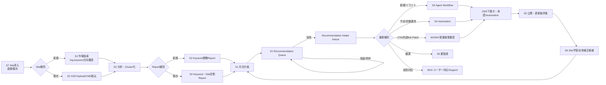

### 0.1 新規Site導入

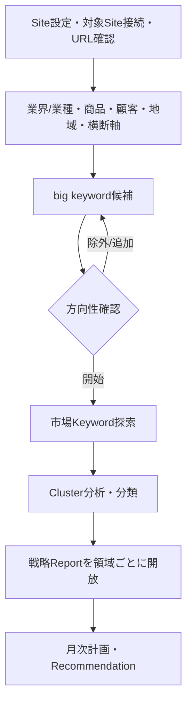

### 0.2 既存Site導入

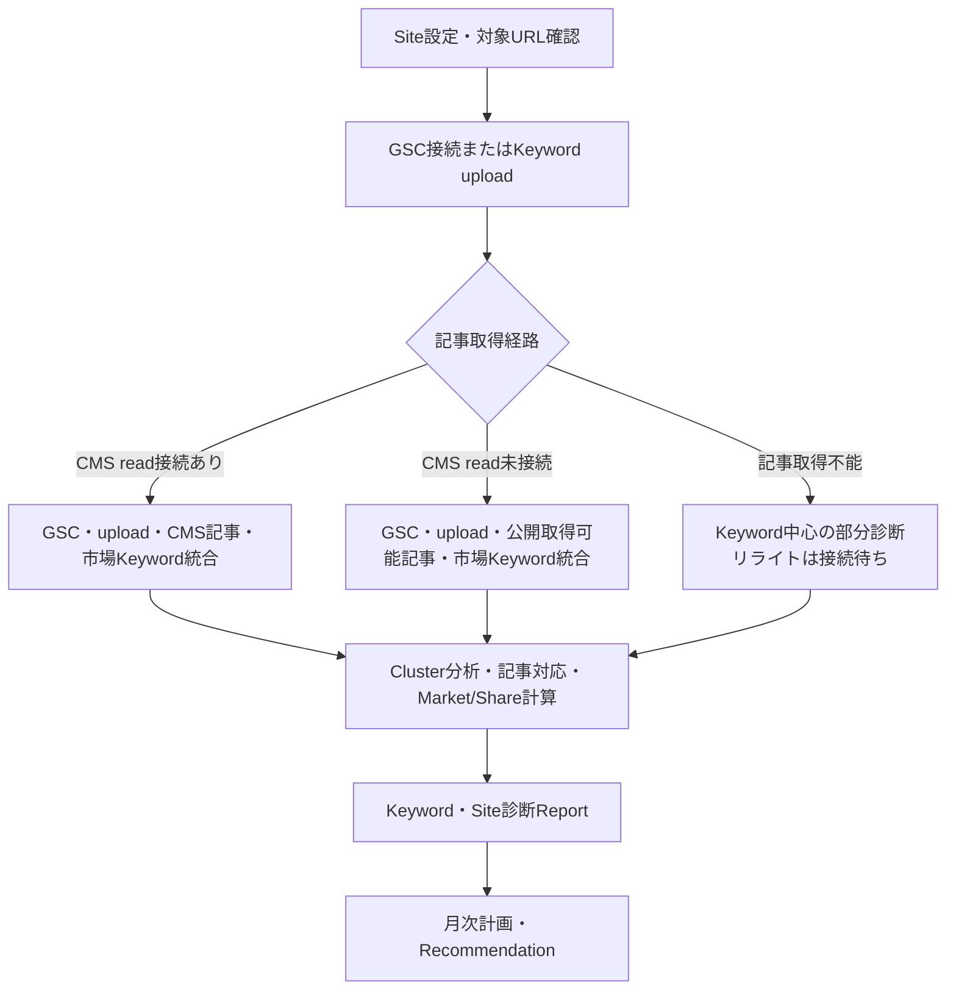

Site登録時には対象Siteとの接続、URL、Site Contextを確定するが、分析開始とCMS書込Capabilityを同一Gateにしない。新規記事またはリライトをCMSへ送信する時点では、REST API等の検証済みwrite Capabilityを必須とする。既存Siteのリライト推薦は記事本文・見出し・公開状態を取得できる経路が成立した範囲だけで開放し、GSCまたはKeyword入力だけで本文更新を推測実行しない。

### 0.3 Recommendationから評価まで

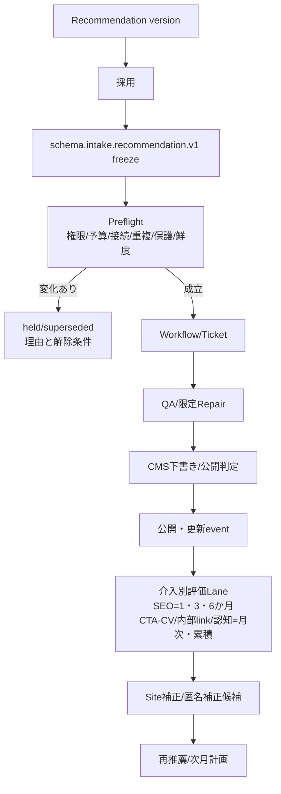

### 0.4 Reportから月次計画・Recommendation

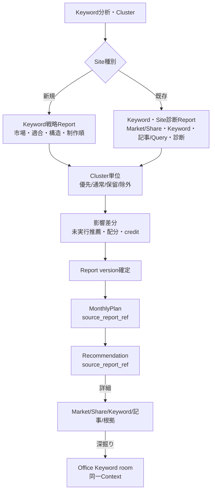

MonthlyPlan確定後は全Actionを直ちに起動しない。週次選択でcredit、依存、保護、品質、処理Capacityへ収まる候補をfreezeし、各ActionをExecution Admissionへ渡す。手動の一括確認もAction別判定を残し、自動確定もAutomation Policyを新規付与しない。S3カレンダーから月次目的・カテゴリー／テーマ戦略・施策順を変える場合はS1 Planning Context、CMS公開予約を変える場合はS4 Automation Contextへ遷移する。

## 1. 全体マップ（通常ビュー）

サイドメニュー=第一階層7項目、ヘッダー=グローバル要素（REQ-NAV-02）。W系は呼び出し元文脈で開く（パネル/ドロワー、第三階層）。

Recommendation Intake後の分岐はAction Routing Mapを正本とする。`new_article / rewrite`だけをAgentic content Workflowへ、`cta_patch / internal_link_patch`を軽量Patchへ、`observe / protect / no_action`をJobなしの観測・Policy・終端へ、`structure_change_proposal / technical_escalation`をユーザー対応へ、`automation_change`を型付きPolicy変更へ送る。「採用したのでAgent Jobを作る」を共通経路にしない。

### 1.1 通常ビューとAgent Officeの往復・詳細操作フロー（2026-08-03現行要求）

通常ビューとOfficeは別システムではない。通常ビューはRecommendation中心の要約と簡単操作、Officeは同じProjection・認可・Domain Commandを用いる玄人向け詳細分析・運用面である。Officeは成果、Keyword、記事、根拠、条件、設定、Taskを横断し、選択式操作または型付きProposalから共通Commandへ接続する。

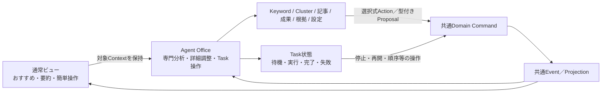

## 2. Recommendation／手動指定から生成〜公開（UJ-05）

既定入口はversion付きRecommendationである。S3でKeyword、目的、CTA、内部link、品質、予算を再入力しない。ユーザー探索による手動指定も許可するが、Recommendation採用を偽装せずManual Intakeへ保存し、Recommendation Intakeと同じPreflightへ通す。

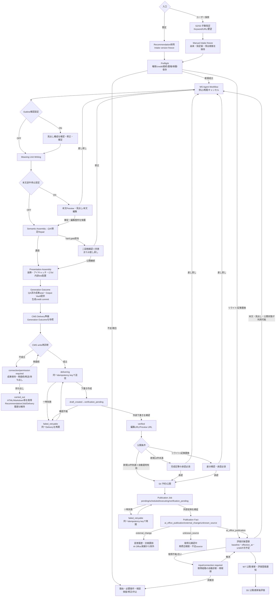

## 3. キーワード分析→Report→Recommendation（UJ-04）

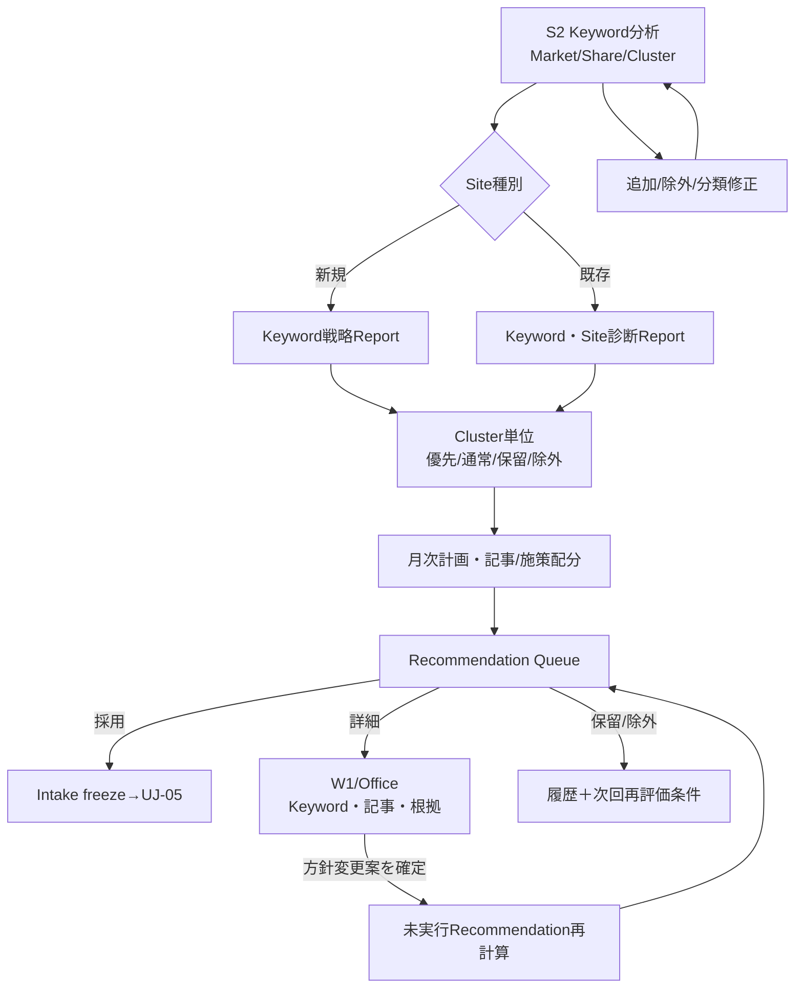

## 4. 通知起点の対処フロー（UJ-03/07、通知→2遷移以内）

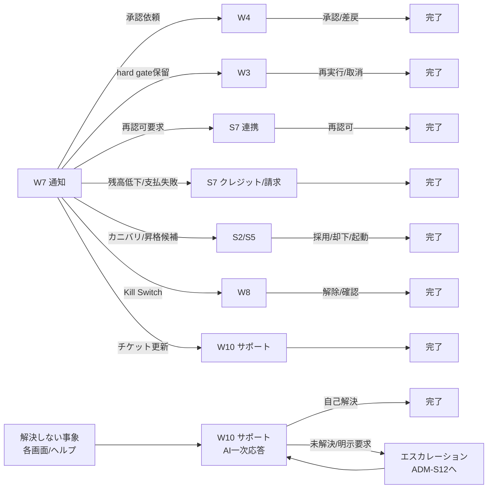

## 5. 初期導入フロー（UJ-02）

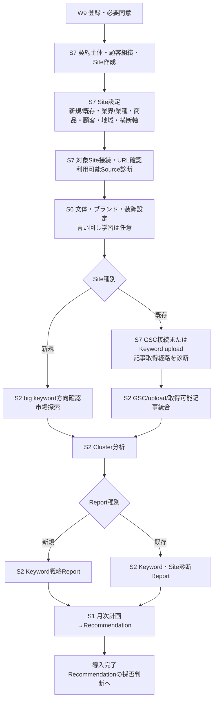

CMS REST API等のwrite接続は、導入時に設定できるがKeyword分析の直列必須工程にはしない。接続失敗時も成立済みSourceで分析・Reportを進め、CMS送信を伴うRecommendationだけ`connection_required`で保留する。新規記事送信、リライト送信、Media登録、公開・更新へ進む前には、対象operationごとのwrite Capabilityを再診断する。

最初の新規15記事の承認と自動運用解放は導入完了条件ではなく、UJ-05の公開Loopを通じて累積する運用上の解放条件である。予約、下書き、API受付、外部変更、帰属確認中、既存記事、外部作成記事、リライトを数えず、本システム経由で人が承認し、confirmed `ai_office_publication` Factが成立した新規記事だけを数える。15件到達後も自動的にONへせず、権限者が責任範囲、予算、品質、停止条件と同意書を確定した場合だけ新規記事の個別承認省略を解放する。

## 6. 管理コンソール全体（UJ-08）

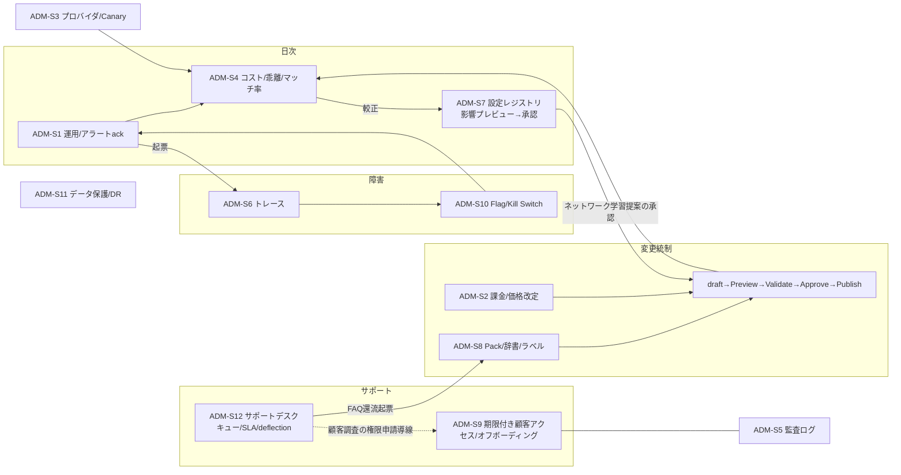

## 7. 月次プランニング・フロー（UJ-09）

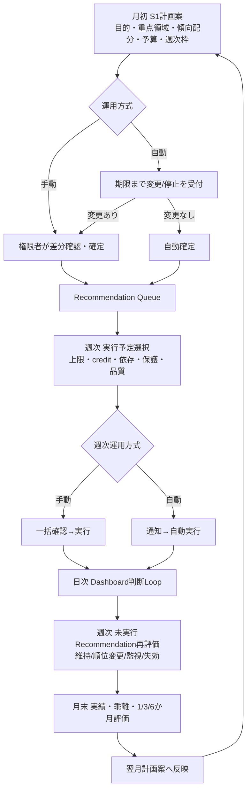

補足: 各Sノードは第二階層タブ（画面台帳§5）を持ち、通知・引き継ぎはタブへ直リンクする（2遷移以内の前提）。

## 8. 正規遷移契約マトリクス

図だけでは入口条件、認可、失敗時の復帰先を検証できないため、以下を画面遷移の受入正本とする。基本権限は `契約者 / サイトオーナー / ユーザー`、SEO業務の変更能力は `目標管理 / キーワード・サイト戦略 / 記事制作 / サイト分析` の業務権限で判定する。基本権限だけを理由にSEO業務操作を許可しない。Site AssignmentがないMembershipは全Site、指定があるMembershipは指定Siteだけを対象とする。閲覧可能な結果と、設定・状態を変更できる操作を分ける。

| 遷移 | 開始条件 | 変更操作に必要な権限 | 成功時 | 不成立・失敗時と復帰先 | 要求正本 |
|---|---|---|---|---|---|
| 登録・同意 → 顧客組織／Site作成 | 有効な顧客Session、必須同意 | 初回契約者。既存組織へのSite追加は契約者または対象範囲のサイトオーナー | Site設定へ | 同意不足、Plan上限、権限不足を同画面に表示し、入力を保持 | REQ-UJ-02 / REQ-ORG-01〜04 / REQ-ACCESS-08 |
| Site設定 → Source診断 | Site基本情報、対象URL | 契約者またはサイトオーナー | 新規／既存の入力分岐へ | GSC、Keyword入力、CMS read/write、公開取得をCapability別に表示する。write不足だけで分析を止めず、CMS送信を伴う遷移で再接続先と復帰先を示す | REQ-BUS-02 / REQ-INT-01・05 / REQ-SCREEN-01 |
| 新規Site → big keyword方向確認 | `site_identified`、業界／業種等の探索入力。未設定分類は推定可。CMS writeは不要 | 候補閲覧は全員、追加・除外・方向確定はキーワード・サイト戦略 | 市場探索・Cluster分析へ | 候補不足時は探索条件と追加入力へ戻す。空Recommendationへ進めない | REQ-BUS-02・03 / REQ-SCREEN-01 / REQ-KRL-01 |
| 既存Site → Keyword統合 | GSCまたはKeyword upload。記事対応・リライトにはCMS記事取得も必要 | 接続設定は契約者またはサイトオーナー、Keyword追加・分類修正はキーワード・サイト戦略 | Market／Share・Cluster分析へ | Source別availabilityを表示し、利用できるSourceだけで部分処理。リライト不成立でも新規施策を止めない | REQ-BUS-02〜04 / REQ-DATA-06 / REQ-SCREEN-05 |
| 分析 → 戦略／診断Report | 分析対象Keywordが1 Cluster以上成立 | 閲覧は全員、分析条件・評価設定変更はサイト分析、Cluster優先度等の変更はキーワード・サイト戦略 | 領域単位でReportを開放 | 未完了領域は処理中／不足／staleを表示し、完了領域の閲覧を妨げない | REQ-BUS-04・05 / REQ-SCREEN-04・05 |
| Report → 月次計画 | Report versionが存在 | 目的・KPI・月次方針確定は目標管理。予算設定・配賦は契約者またはサイトオーナー | source_report_ref付きMonthlyPlan案へ | Report変更時は未実行分への影響差分を表示し、確定済み・実行済み履歴を保持 | REQ-BUS-06 / REQ-ORG-03・05 / REQ-UJ-09 |
| 月次計画 → 週次実行予定 | 計画確定または自動確定期限到達 | 手動確定・方針変更は目標管理。予算変更は契約者またはサイトオーナー | 今週の実行予定へ | credit、Capacity、依存、保護、品質不足を項目別に保留し、月次計画へ戻して再計算可能 | REQ-BUS-06・07 / REQ-SCREEN-01 |
| Recommendation → Intake | version、根拠、入力availability、予測credit、依存、保護条件が成立 | 戦略的な採否・除外はキーワード・サイト戦略。個別記事の実行採否は記事制作 | freeze済みIntakeを作成しExecution Admissionへ | 採用後の実行条件不足をRecommendation不採用へ書き換えず、Admission側で理由と復帰先を表示する | REQ-BUS-08 / REQ-LOGIC-01〜03 / REQ-SCREEN-02・03 |
| Intake → Execution Admission → 正規Action | `schema.execution.admission.v1`が入力、権限、Entitlement、予算、重複、カニバリ、保護、接続、Capacity、Kill Switch、見積をversion付きで判定。有償ActionはCredit reserve成立。リライト／記事置換は有効な`schema.snapshot.article_read.v1`を参照 | Actionに対応する業務権限。reserve／自動チャージ設定は契約者またはサイトオーナーの範囲を追加適用 | Admissionを一度consumeし、Agent Workflow、Patch、Policy、Domain Command、ユーザー対応等の正規Actionへdispatch。Task HistoryはJobを持つActionだけ表示 | 不足はAdmissionをheld／rejectedとし、Intakeを保持して入力、再取得、権限、追加購入、品質変更等へ戻す。可変Gateがdispatch直前に変わればconsumeせず再評価する。同一Job再開では再reserveしない | REQ-LOGIC-11 / REQ-SEC-12 / REQ-BILLING-04 / REQ-AGENT-10 / REQ-DATA-15 |
| Outline → 本文・QA・装飾 | Outline Contract成立 | 記事制作。途中確認ONの場合のみ確認操作 | CMS送信前成果へ | 差し戻しは対象stageへ戻り、ユーザー編集箇所を保護。再生成時は追加credit条件を表示 | REQ-SCREEN-15 / REQ-LOGIC-05〜07 |
| QA済みPresentation → Generation Outcome | QA seal、content hash、非公開Vault stagingのsize／read検証、未消費Reservationが成立 | 記事制作。内部Provision操作はユーザー操作にしない | Outcome、commit Ledger、deliverable／commit outboxを同一transactionで確定後、成果を表示・copy・download可能にしてJob完了へ | staging／検証／transaction失敗は成果提供済みにせずcleanup・retryする。commitだけ、Outcomeだけを残さない | REQ-BILLING-04 / REQ-DATA-03 / REQ-AGENT-10 |
| Generation Outcome → CMS下書き | `schema.generation.outcome.v1`が成果提供、Output Vault期限、生成credit確定を一意に保持し、それを参照する`schema.cms.delivery.v1`を作成。CMS write Capabilityと副作用直前の再認可が成立 | 記事制作 | Generation Outcomeを保ったまま`prepared → delivering → draft_created → verification_pending → verified`を表示し、検証済み編集URL／Previewへ | REST切断、Scope不足、互換性低下ではGeneration OutcomeとDelivery IDを保持する。`failed_retryable`は同一idempotency keyで再開し、再生成・二重reserve／commit・二重下書きを起こさない。Vault期限後はOutcomeを生成失敗へ戻さず、再送不可と必要操作を表示する。持ち出しは`carried_out`であり公開成功には数えない | REQ-BILLING-04 / REQ-INT-01・05・10 / REQ-SCREEN-15・16 / REQ-TECH-18 |
| CMS下書き → 公開・更新 | version付きPublication Decisionが、新規15件ルール、承認設定、自動運用委任、hard gate、認可、接続、対象種別を副作用前入力から判定 | 記事制作。自動運用設定は契約者またはサイトオーナー＋該当業務権限・step-up | Publication Jobの`pending / scheduled / executing / verification_pending / verified`へ。外部検証後に時刻Source・精度付きPublication Factを作成 | 新規15件未達は完成記事承認へ。リライト・記事置換は原則承認へ。hard gateは同一権限者の二段階確認＋同意へ。予約・Command・API受付・Webhook受信・検証終了を公開成功または`effective_at`にしない。時刻不整合は帰属確認中へ | REQ-ORG-05・06 / REQ-WPA-04 / REQ-ACCESS-08・16 / REQ-MEASURE-13・14 |
| Publication Fact → 評価 → 次回計画 | `ai_office_publication`で外部反映検証済み、時刻整合済みのFact。外部の実質変更は既存評価の交絡要因として別処理 | 閲覧は全員、分析条件・評価確定はサイト分析、補正採用や方針変更は対応する業務権限 | Factの`effective_at`を起点にbaselineと1・3・6か月予定を一意登録し、月次／累積結果、次回Recommendationへ。初回条件適合FactはActivationを一度だけ導出 | `unknown_source`は再照合、`external_change`はAI Office実績から除外。重複eventはcount／Lane／Loopを増やさない。派生失敗はFactを巻き戻さず再開し、遅延確定は到来済みcheckpointをcatch upする | REQ-BUS-09・10 / REQ-MEASURE-13・14 / REQ-SCREEN-13 / REQ-KRL-05〜10 |
| 通常ビュー ⇄ Office | 同じtenant、Site、対象ID、versionへの閲覧権限 | 閲覧は共通。変更は通常ビューと同じ基本権限・業務権限 | 同一Command／Eventを両Viewへ反映 | Office独自状態や権限迂回を作らず、拒否理由と通常ビューの解消先を表示 | REQ-SCREEN-08〜11・18・19 / REQ-ACCESS-01・14〜16 |
| 顧客面 → 内部管理面 | 遷移不可 | なし | なし | URL／API直接指定もdefault-deny。内部支援は管理面で期限付き代理権限を開始し、代理操作表示を維持 | REQ-ACCESS-01〜03 / REQ-SCREEN-07 |

### 8.1 遷移状態の共通表現

各遷移は業務上の`transition_outcome`として `ready / processing / partially_available / awaiting_approval / held / failed_retryable / unavailable`を返し、表示可否は別の`schema.ui.availability.v1`を返す。Availabilityの画面状態は`blocked / degraded / preview / partial / pending / ready`へ固定し、`input_required / permission_denied / plan_locked / connection_required / data_insufficient / budget_or_credit_insufficient / consent_or_approval_required`等は`reasons[].class/code`として保持する。画面はClient側で状態を再計算せず、Server判定のprimary reason、全理由、解消操作、復帰先を表示する。入力・接続不足を機能全体の利用不可へ拡大せず、成立している閲覧、分析、生成、持ち出しを継続する。

Site導入・接続画面は、`site_identified`をSite単位、`analysis_ready`を分析version単位、`content_read_ready`を記事単位、`delivery_ready`をoperation単位で受け取る。画面用の「準備完了率」はこれらのProjectionから導出する表示値に限り、保存された単一`connected` boolを正本にしない。Article Read Snapshot失効、credential失効、Capability／Permission変更を受けた場合は、影響scopeだけを`held`または`unavailable`へ変更し、理由、解消操作、元のRecommendation／Taskへの`return_context`を表示する。再接続後は同じID／version／correlationを保って再判定し、Recommendation再生成やGeneration Outcome再生成を要求しない。

遷移Contextには `tenant_id`、`site_id`、`source_screen`、`source_tab`、`source_filter`、対象ID、対象version、`correlation_id` を含める。通知、Dashboard、Office、Task Historyから遷移しても同一Contextを復元し、別Siteまたは旧versionへ黙って移動しない。

横断検索からの遷移はこれに`source=search`、query、Document type、result positionを加える。検索hitは遷移候補であり業務正本ではないため、副作用Actionの前に対象Aggregateを再読込して認可・version・状態を再判定する。通常結果は該当S画面・tab、Office結果は同じ対象のWorkbenchへ移り、戻る操作でquery、filter、scroll位置を復元する。

## 9. 検証規約

- 各ジャーニー（REQ-UJ-02〜09）のステップ列は本図のパスとして到達可能であること（AC-UJ-02〜09）。
- 終端のないノード（行き止まり）を作らない（REQ-UJ-01）。空状態・完了状態の次アクションは画面台帳§0に従う。
- プロト検証: PT-S（本図の全パスをクリック到達で検証、通知→対処2遷移以内の計測）。
- 遷移ごとに `source screen/tab/filter`、`tenant_id`、`site_id`、対象IDとversion、`correlation_id` を保持し、戻る操作で起点Contextを復元する。
- 入口条件を満たさない場合は別画面へ黙って迂回させず、同一Contextで `権限 / Plan / credit・予算 / CMS・GSC等の接続 / データ / 承認 / 処理中 / 障害` を分離表示し、解消画面と復帰先を示す。
- `screen-inventory` は画面責務、`screen-flow` は正規遷移、`screen-connection-map` は既存プロト実測と追随差分を正本とし、同じ目的で競合する遷移定義を複製しない。
- §8の各行について、許可ケース、業務権限なし、Site範囲外、接続切断、Plan／credit不足、処理中、再試行、戻る操作を受入試験化する。画面非表示だけで認可試験を代替しない。
