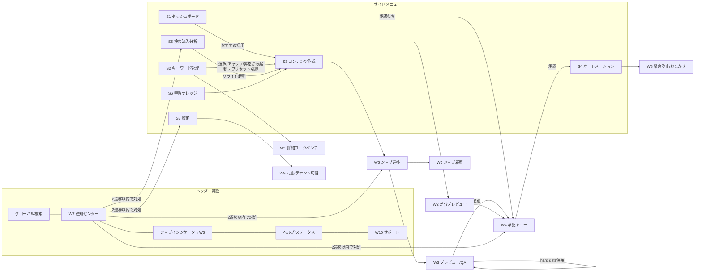
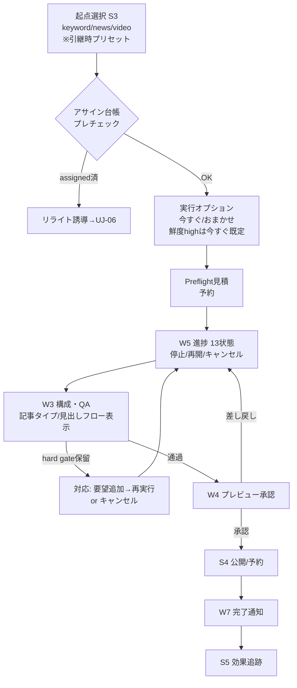
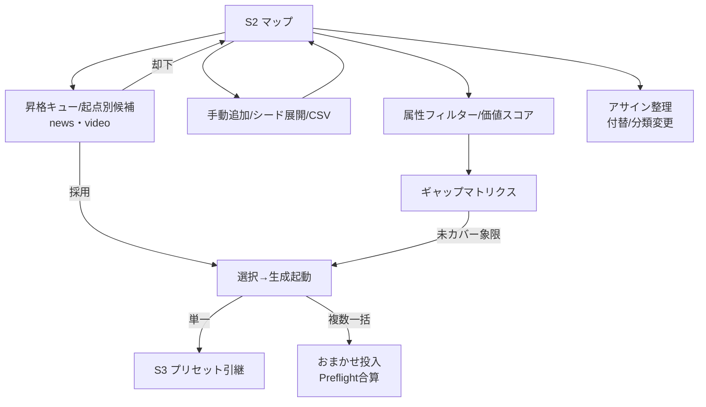
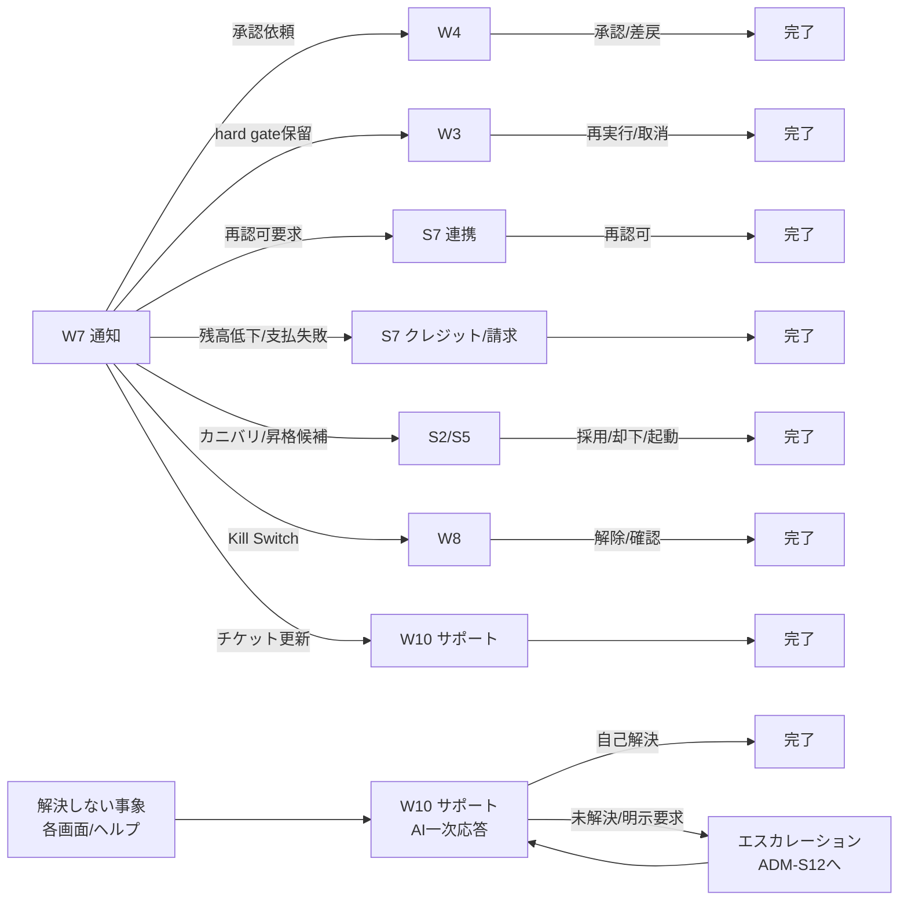
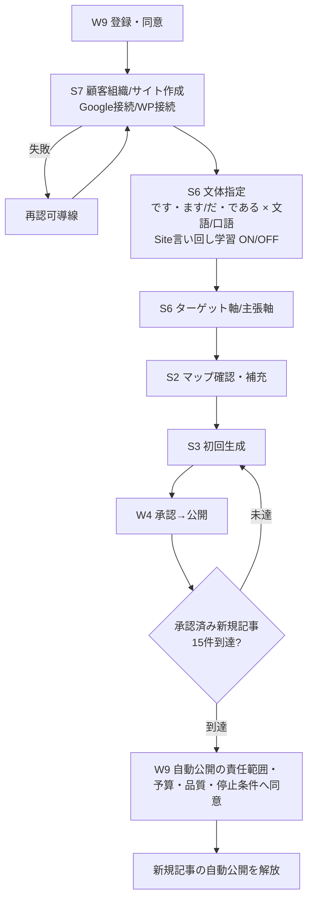
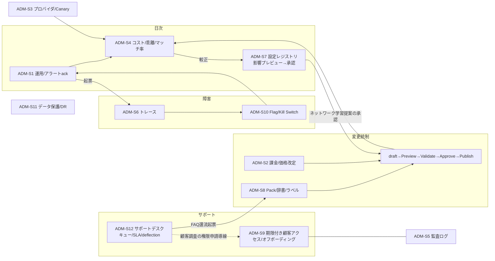
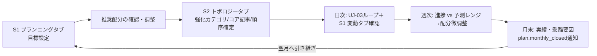

# AI Office de SEO 画面遷移図

ユーザー行動要件（REQ-UJ-01〜09）から導出。ノードは画面台帳のID。**遷移図にない遷移をジャーニーが要求しない／ジャーニーにない行き止まりを作らない**（AC-UJ検証対象）。

## 1. 全体マップ（通常ビュー）

サイドメニュー=第一階層7項目、ヘッダー=グローバル要素（REQ-NAV-02）。W系は呼び出し元文脈で開く（パネル/ドロワー、第三階層）。

## 2. 生成〜公開フロー（UJ-05）

## 3. キーワード戦略→生成フロー（UJ-04）

## 4. 通知起点の対処フロー（UJ-03/07、通知→2遷移以内）

## 5. 初期導入フロー（UJ-02）

## 6. 管理コンソール全体（UJ-08）

## 7. 月次プランニング・フロー（UJ-09）

補足: 各Sノードは第二階層タブ（画面台帳§5）を持ち、通知・引き継ぎはタブへ直リンクする（2遷移以内の前提）。

## 8. 検証規約

- 各ジャーニー（REQ-UJ-02〜09）のステップ列は本図のパスとして到達可能であること（AC-UJ-02〜09）。
- 終端のないノード（行き止まり）を作らない（REQ-UJ-01）。空状態・完了状態の次アクションは画面台帳§0に従う。
- プロト検証: PT-S（本図の全パスをクリック到達で検証、通知→対処2遷移以内の計測）。
