# AI Office de SEO 画面遷移図

ユーザー行動要件（REQ-UJ-01〜09）から導出。ノードは画面台帳のID。**遷移図にない遷移をジャーニーが要求しない／ジャーニーにない行き止まりを作らない**（AC-UJ検証対象）。

## 0. 現行Lifecycle正本（2026-08-03）

以下を現行の最上位画面遷移とする。本書の全節はこのLifecycleを詳細化する。既存プロトの実装遷移は `ai-office-de-seo-screen-connection-map_v1.md` に隔離し、本書の正規遷移を上書きしない。

本図は将来像だけを示す参考図ではなく、画面台帳、URL／状態、画面Availability、受入試験へ渡す遷移正本である。プロト実装は後続更新とするが、画面設計では各遷移の入口条件、保持Context、保留理由、復帰先まで本図へ一致させる。

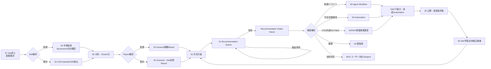

### 0.1 新規Site導入

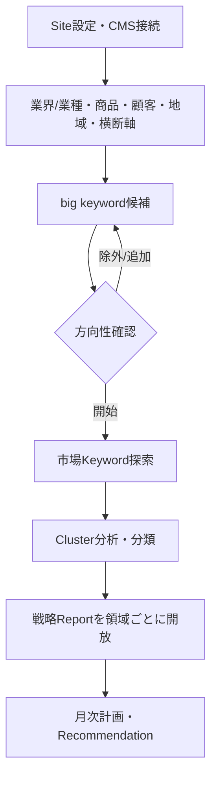

### 0.2 既存Site導入

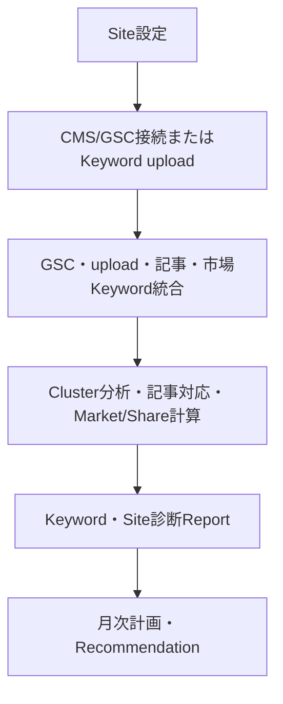

### 0.3 Recommendationから評価まで

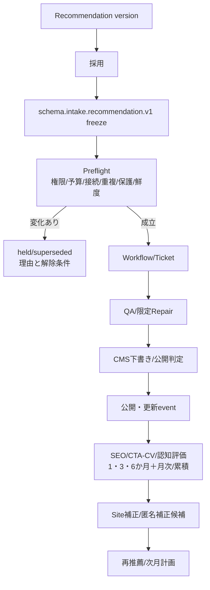

### 0.4 Reportから月次計画・Recommendation

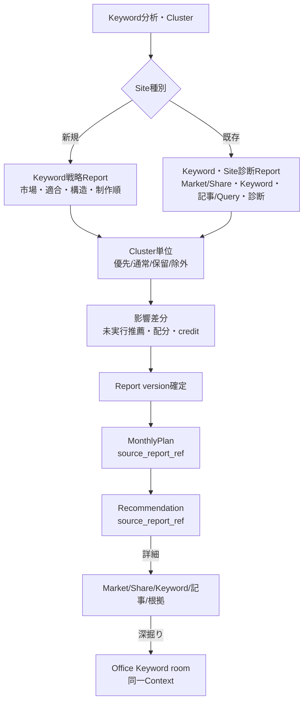

## 1. 全体マップ（通常ビュー）

サイドメニュー=第一階層7項目、ヘッダー=グローバル要素（REQ-NAV-02）。W系は呼び出し元文脈で開く（パネル/ドロワー、第三階層）。

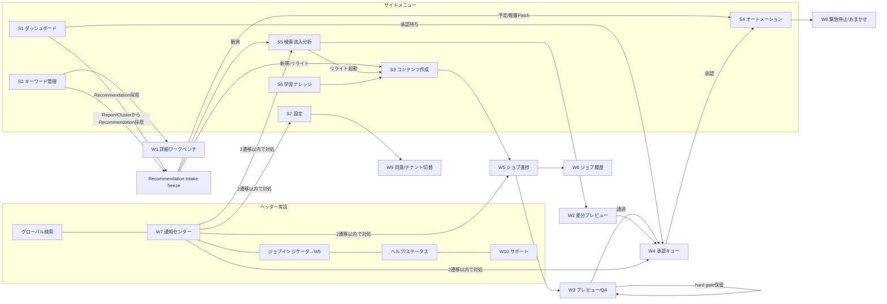

### 1.1 通常ビューとAgent Officeの往復・変更フロー（2026-08-03現行要求）

通常ビューとOfficeは別システムではない。通常ビューは簡単操作、Officeは同じ対象を深掘りし、Agentとの会話や詳細条件から操作するViewである。Office内の状態変更は会話文を直接実行せず、共通の変更案・Task・Commandへ変換する。

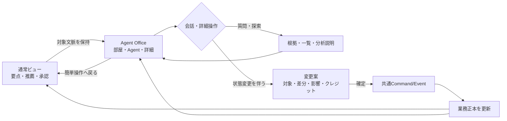

## 2. Recommendation／手動指定から生成〜公開（UJ-05）

既定入口はversion付きRecommendationである。S3でKeyword、目的、CTA、内部link、品質、予算を再入力しない。ユーザー探索による手動指定も許可するが、Recommendationと同じIntake SchemaとPreflightへ正規化する。

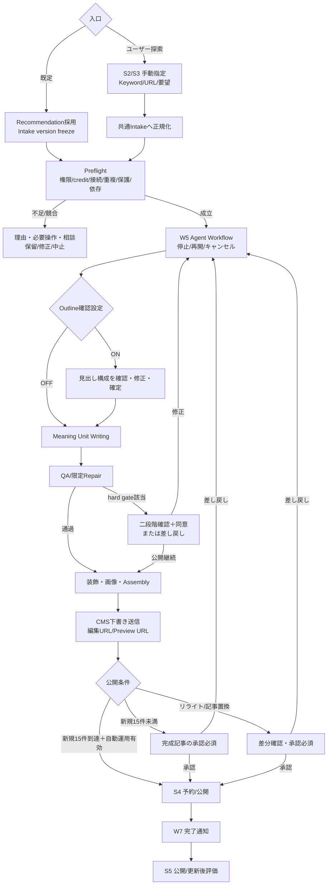

## 3. キーワード分析→Report→Recommendation（UJ-04）

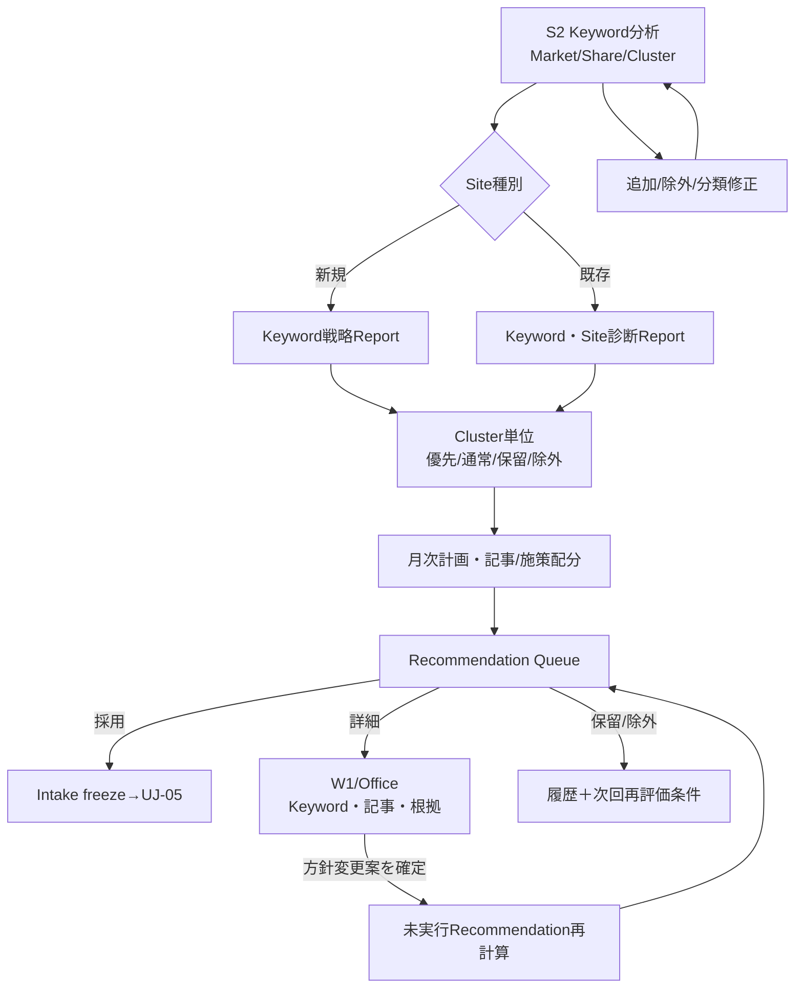

## 4. 通知起点の対処フロー（UJ-03/07、通知→2遷移以内）

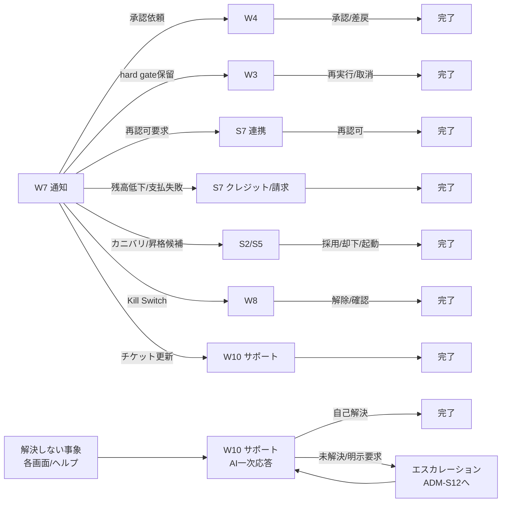

## 5. 初期導入フロー（UJ-02）

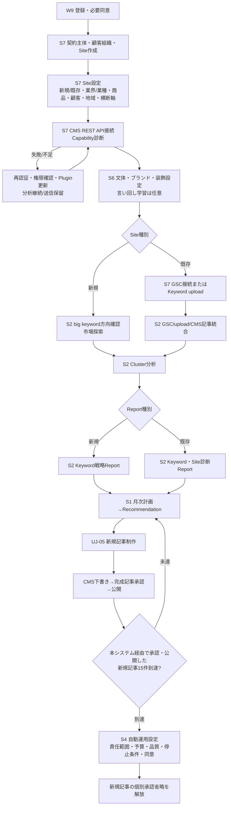

## 6. 管理コンソール全体（UJ-08）

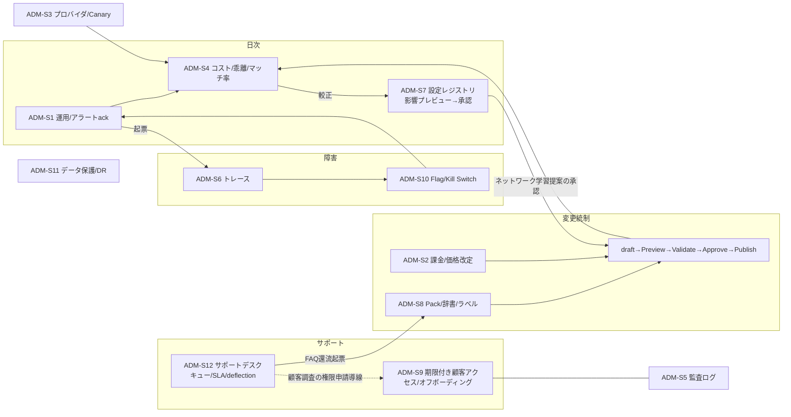

## 7. 月次プランニング・フロー（UJ-09）

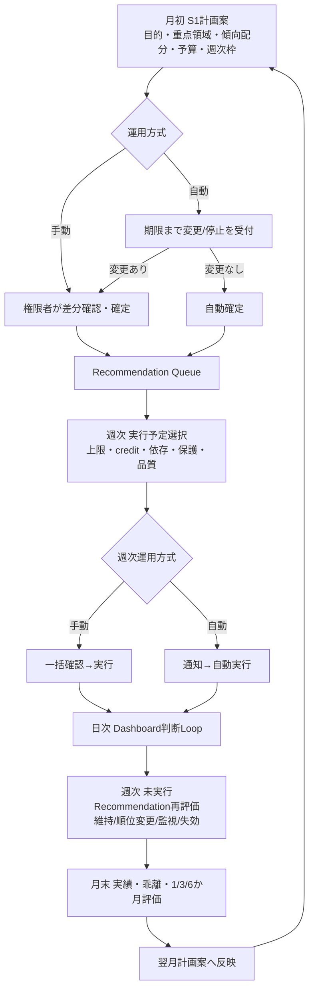

補足: 各Sノードは第二階層タブ（画面台帳§5）を持ち、通知・引き継ぎはタブへ直リンクする（2遷移以内の前提）。

## 8. 検証規約

- 各ジャーニー（REQ-UJ-02〜09）のステップ列は本図のパスとして到達可能であること（AC-UJ-02〜09）。
- 終端のないノード（行き止まり）を作らない（REQ-UJ-01）。空状態・完了状態の次アクションは画面台帳§0に従う。
- プロト検証: PT-S（本図の全パスをクリック到達で検証、通知→対処2遷移以内の計測）。
- 遷移ごとに `source screen/tab/filter`、`tenant_id`、`site_id`、対象IDとversion、`correlation_id` を保持し、戻る操作で起点Contextを復元する。
- 入口条件を満たさない場合は別画面へ黙って迂回させず、同一Contextで `権限 / Plan / credit・予算 / CMS・GSC等の接続 / データ / 承認 / 処理中 / 障害` を分離表示し、解消画面と復帰先を示す。
- `screen-inventory` は画面責務、`screen-flow` は正規遷移、`screen-connection-map` は既存プロト実測と追随差分を正本とし、同じ目的で競合する遷移定義を複製しない。
