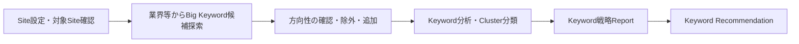
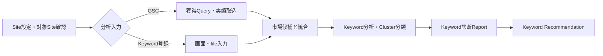

# 新規／既存Site導入・段階開放 画面検証仕様

## 1. 目的

本書は、新規Siteと既存Siteで異なる分析開始条件、記事読取り条件、CMS送信条件を、ユーザーが技術経路を理解しなくても設定・復旧できる画面として検証するpre-L3仕様である。

Site導入を単一の「接続済み」に丸めず、分析できる範囲、リライトできる記事、CMSへ送れる操作を分ける。一方、ユーザーへAdapter、fallback、polling、rate limit等の開発都合を設定させない。検証で画面上の不足・過剰・責務ずれが判明した場合はL1/L2へ戻し、L3のAPI、状態契約、保存方式を先に固定しない。

## 2. 固定する業務意味

### 2.1 新規Site

- `site_identified`と、業界／業種、商品・サービス、対象顧客、地域、横断軸等の市場探索入力を最低条件とする。
- 最初に単一語のBig Keyword候補を見せ、方向性が合うかをユーザーが確認する。候補を全件自動登録しない。
- GSC、既存Keyword、CMS記事読取りは市場探索の必須条件ではない。
- CMS write未成立でも分析、Report、Recommendation、生成を止めず、CMS送信だけを保留する。

### 2.2 既存Site

- GSCまたはKeyword登録の少なくとも一方で`analysis_ready`を成立させる。両方を必須にしない。
- 市場候補、GSC Query、登録Keyword、適格な競合Keywordを統合し、GSCの獲得語だけを市場全体とみなさない。
- 新規記事Recommendationは分析対象Clusterが成立すれば提示できる。
- リライトRecommendationは、対象記事の本文・見出し・公開状態を取得したArticle Read Snapshotがある記事だけを対象にする。GSC実績だけで本文変更を推測しない。

## 3. 四つの準備状態

画面では内部keyを主ラベルにせず、業務上の意味と次の操作を表示する。

| 内部状態 | ユーザー向け意味 | 粒度 | 解放範囲 | 未成立でも継続すること |
|---|---|---|---|---|
| `site_identified` | 対象Siteを確認済み | Site | Site設定、市場探索、接続診断 | 入力保存、接続修復 |
| `analysis_ready` | キーワード分析を開始可能 | 分析version／Cluster範囲 | Report、新規記事Recommendation | 接続診断、取得済み範囲の閲覧 |
| `content_read_ready` | 記事内容を確認済み | 記事 | 当該記事のリライト診断・Intake | 新規記事業務、他の取得済み記事 |
| `delivery_ready` | CMSへ送信可能 | `create_draft / update_post / upload_media / publish`等のoperation | 成立operationだけ | 分析、Recommendation、生成、成果保持、持ち出し |

`準備率80%`等の要約を表示してもよいが、四状態を合算した保存値または単一Gateにしない。要約から、どの機能が使え、何が不足しているかへ展開できなければならない。

## 4. ユーザー設定とシステム制御の境界

| ユーザーが設定・選択する | システムが診断・制御する | 顧客画面へ出さない |
|---|---|---|
| Site URL、Site名、新規／既存、業界／業種、商品、顧客、地域、横断軸、目的、CV、文体 | Site到達性、Source availability、記事coverage、operation別CMS Capability、互換性、段階開放、再試行 | primary／fallback経路、Crawler優先順位、polling、rate limit、timeout、内部Adapter名、queue partition |
| GSC接続またはKeyword登録、必要なCMS認証、Plugin導入 | 通る取得経路のうち低負荷な経路選択、差分同期、hash判定、429時の減速 | 経路固定、手動failover、Headless Browser常用指定 |
| Big Keyword候補の確認・除外・追加 | 候補収集、重複整理、分析・Cluster化、coverage計算 | Provider選択、API問い合わせ方式 |

## 5. 画面案の比較

### 5.1 案A — 業務Step＋並行準備Tray（第一検証案）

中央に新規／既存それぞれの5段階業務Stepを表示し、右側または下部に`分析データ / 記事読取り / CMS送信`の準備Trayを並行表示する。

- 業務Stepはユーザーが次に何をするかを示す。
- 準備Trayは各機能が使える範囲と不足だけを示す。
- CMS write不足で分析Stepをlockしない。
- 記事読取りcoverageが一部なら、取得済み記事のリライトと新規記事業務を開放する。

### 5.2 案B — 利用可能機能カード型（比較案）

導入Dashboardに`市場分析 / 新規記事 / リライト / CMS下書き / 画像送信 / 公開`カードを置き、利用可能、準備中、入力が必要、一部利用可を示す。ユーザーは使いたい機能から不足項目へ進む。

機能価値から理解しやすい一方、初回に何から始めるかが分散しやすい。初回は案A、導入後の接続管理は案Bとする組合せも比較する。

## 6. 自動構築期間と段階開放

- 大規模Siteは数日へ分散でき、通常規模でも全件完了を待たず確定領域から開放する。
- 現在工程、取得済み範囲、未分析範囲、利用可能／制限中機能、概算完了、失敗・再試行を表示する。
- `partially_available`を失敗または全体完了として表示しない。
- coverageはSource、Cluster、記事等の意味ある母数を伴って表示し、異なる母数を一つの進捗率へ合算しない。
- 失敗したSourceだけを再試行し、完了済み分析やRecommendationを初期化しない。

## 7. 必須fixture

| Fixture | 条件 | 期待する表示・動作 | 禁止する挙動 |
|---|---|---|---|
| ONB-UI-01 新規・接続最小 | Site確認＋市場探索入力、GSC/CMSなし | Big Keyword方向確認へ進む | GSC／CMS writeを要求 |
| ONB-UI-02 新規・方向修正 | 候補が方向違い | 除外・追加後に分析を開始 | 全候補を自動登録 |
| ONB-UI-03 既存・GSCのみ | GSC成立、Keyword fileなし | 統合分析へ進み重要語追加も可能 | file登録を必須化 |
| ONB-UI-04 既存・Keywordのみ | GSCなし、Keyword登録あり | 市場推定の限界を示し分析へ | 空Recommendation、GSC強制 |
| ONB-UI-05 両方なし | 既存Site、GSC/Keywordなし | 必要な二択を案内 | 空一覧を正常表示 |
| ONB-UI-06 一部記事読取 | 100記事中60記事取得 | 60記事の診断、新規記事業務を開放 | 全記事取得まで停止 |
| ONB-UI-07 記事読取不可 | 分析成立、Article Readなし | 新規Recommendation継続、リライトだけ読取必要 | GSCだけでリライト生成 |
| ONB-UI-08 下書きのみ可能 | create_draft ready、update/media/publish不可 | 新規下書き送信だけ可能 | 接続済みとして全操作許可 |
| ONB-UI-09 生成後に接続切れ | Generation Outcome成立、CMS write失効 | 成果保持、再接続・再送・持ち出し | 生成失敗、再生成、再課金 |
| ONB-UI-10 大規模部分開放 | Cluster 40%、記事60% | coverage別に利用可能機能を開放 | 単一60%または完了表示 |
| ONB-UI-11 Source部分失敗 | GSC遅延、Keyword市場取得済み | 市場側を継続しGSCだけ再試行 | 全構築を失敗へ戻す |
| ONB-UI-12 Site移行 | URL／CMS変更 | 影響Capabilityだけ再診断 | Report・履歴を全削除 |
| ONB-UI-13 権限不足 | Site閲覧可、接続変更不可 | 状態閲覧と権限者依頼 | 画面非表示だけ、Office迂回 |
| ONB-UI-14 WP Thin Plugin | 初回導入／再認可／更新必要 | ZIP、期限付きpairing、状態別案内 | 初回を「再認可」と表示 |
| ONB-UI-15 CMS非対応 | readまたはwrite一部未対応 | 対応範囲と持ち出しを表示 | WordPress以外を対応済み表示 |

## 8. 判定基準

- 新規Site利用者が、GSCや既存記事なしで市場探索を開始できる。
- 既存Site利用者が、GSCまたはKeyword登録の一方から分析を開始できる。
- CMS writeがなくても分析、Recommendation、生成まで進め、送信時だけ止まることを理解できる。
- Article Read不足がSite全体ではなく記事単位で表現され、新規記事業務を巻き込まない。
- 利用者が四つの内部keyを覚えなくても、利用可能な機能、不足、次の一操作を説明できる。
- 技術経路の選択を求めず、接続診断とFAQ／問い合わせからシステム側・Site側の原因を区別できる。
- 部分開放でcoverage、未分析範囲、概算完了、再試行対象を誤認しない。
- 通常ビューとOfficeで同じ準備状態を表示し、Office経由で不足Capabilityを迂回しない。

## 9. Findingの還流

検証結果はSite導入findingとして、経路、新規／既存、入力Source、Capability組合せ、停止箇所、誤認したラベル、必要だった操作、不要だった技術情報を記録する。意味変更が必要なら`REQ-BUS-02`、`REQ-SCREEN-01`、`REQ-LOGIC-03`、`REQ-INT-01/05`、`SiteBuildRun`へ先に反映する。

分類別L1を現行要求の正本とし、画面案とfixtureは検証入力である。ブラウザ操作前は`open`とし、静的文書だけで`validated`またはL3確定済みにしない。

## 10. 参照正本

- `categories/business-requirements_v1.md` REQ-BUS-02
- `categories/screen-operation-requirements_v1.md` REQ-SCREEN-01
- `categories/logic-requirements_v1.md` REQ-LOGIC-03
- `categories/integration-requirements_v1.md` REQ-INT-01・05
- `ai-office-de-seo-user-journey-requirements_v3.7.md` REQ-UJ-02
- `ai-office-de-seo-cms-connection-routing-map_v1.md`
- `ai-office-de-seo-domain-model_v3.7.md` SiteBuildRun
