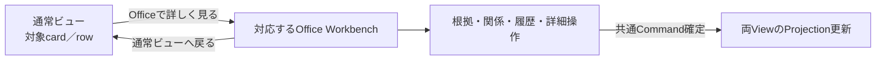
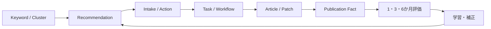

# 通常ビュー・Agent Office 役割分担／往復 画面検証仕様

## 1. 検証目的

通常ビューは、SEOに詳しくない利用者がRecommendationに沿って主要業務を少ない操作で完了する正規入口である。Agent Officeは、同じ対象を専門的に見たい、根拠を確かめたい、少し条件を変えたい利用者が、軽い確認から高度な分析・運用まで段階的に扱う任意の詳細面である。

本書はこの役割分担を画面で検証するpre-L3仕様であり、3D配置、Panel密度、URL形式、会話配置、Graph表現を確定するL3設計ではない。操作検証で判明した不足・過剰・責務ずれをL1/L2へ反映してからL3を確定する。

## 2. 二つのViewの意味

| 観点 | 通常ビュー | Agent Office | 共通不変条件 |
|---|---|---|---|
| 利用目的 | おすすめ、要確認、成果要約から日常業務を完了する | 根拠、関係、履歴、条件、Taskを専門的に分析・調整する | どちらか一方でしか業務を完了できない必須分岐を作らない |
| 情報量 | 結論、理由、影響、費用、現在地、次の一操作 | 計算根拠、構成要素、比較、依存、変更履歴、version、関連entity | 値は同じProjectionから取得し、Officeで再計算しない |
| 操作 | 採否、承認、基本設定、成果確認 | 選択式微調整、詳細条件、Task操作、型付きProposal | 同じAuthorizationと所有BCのDomain Commandを使う |
| 分析 | Site／Cluster／記事の標準drilldown | 同じ成果をKeyword、Cluster、記事、Recommendation、Task、根拠、市場影響、履歴で横断分析 | Officeを成果分析から排除せず、通常ビューの分析も不必要に弱くしない |
| Agent | 重要な説明・提案を要約表示 | 担当ペルソナへ質問し、説明、探索、Proposal／Task候補を得る | ペルソナ数を常駐LLM数、Executor数、model数へ換算しない |
| 状態 | 業務名で簡潔に表示 | stage、待機理由、証拠、依存、return contextまで表示 | 架空進捗や手書き演出状態を作らない |
| 正本 | なし。所有BCのProjectionを利用 | なし。所有BCのProjectionを利用 | Office独自の業務正本、認可、変更Command、成果計算を作らない |

「Office独自の機能」は、別データや別Commandではなく、同じ業務対象に対する専門的な関係表示、比較、段階開示、設備、会話、調整体験を指す。通常ビューをOfficeの簡易skin、Officeを通常ビューの3D menuにしない。

## 3. Contextの最小契約

通常ビューからOfficeへ移動し、分析・調整後に戻るまで、次の意味を保持する。保存方式、URL形式、client state管理は画面検証後にL3で決める。

| Context | 必須となる理由 | 往復時の期待 |
|---|---|---|
| tenant／Site | 顧客・Site越境を防ぐ | Siteを黙って切り替えない |
| source screen／tab | 元の業務位置へ戻す | 元tabを再表示する |
| source filter／sort | 一覧の判断文脈を守る | filterとsortを復元する |
| selected object type／ID | Keyword、Cluster、記事、Recommendation、Task等を識別する | 同じ対象を開く |
| object version | 閲覧・判断対象を固定する | 新versionがあれば差分を表示し、黙って差し替えない |
| correlation ID | Recommendationから実行・評価までを追う | 別Taskの履歴を混ぜない |
| list cursor／scroll anchor | 大量一覧から戻った位置を守る | 元card／rowを視認できる位置へ戻る |
| Office room／persona／panel | Office内の専門文脈を守る | 再入場時に前回の作業位置へ戻れる。ただし業務正本にはしない |

Context復元不能時は、対象詳細または安全な一覧へ明示的に縮退し、別Site、別version、先頭画面へ無言で移動しない。

## 4. 往復案の比較

### 4.1 案A — 対象直結型（第一検証案）

通常ビューの各対象に`Officeで詳しく見る`を置き、対応する部屋、ペルソナ、Workbenchへ直接移動する。戻る操作は元画面、tab、filter、対象位置を復元する。

検証点は、Officeの空間体験を保ちながら対象へ迷わず着地できるか、戻った際に操作結果と一覧位置を認識できるかである。

### 4.2 案B — Officeハブ経由型（比較案）

通常ビューから対象Contextを持ってOfficeハブへ入り、該当Agentの吹き出し、部屋の強調、エレベーター案内からWorkbenchへ移動する。ゲーム的な入場体験とNPCが働く印象を強められる一方、日常操作の遷移数が増える。

必ず比較対象にするが、対象詳細を見たい操作で毎回ハブ探索を強制しない。初回、ユーザーがOffice散策を選んだ場合、演出modeを有効にした場合等へ限定する案も検証する。

## 5. 段階開示案

Officeは専門家専用に閉じず、同じ対象を次の3段階で見せる。段階名と初期展開は検証候補でありL3確定値ではない。

| 段階 | 表示内容 | 主操作 | LLM |
|---|---|---|---|
| すぐ確認 | 状態、重要な理由、影響、次の操作、担当Agent | 選択式の確認・保留・優先変更 | 0回 |
| 詳しく見る | 根拠成分、比較、関連Keyword／記事／Task、変更履歴 | filter、比較軸、許可fieldの微調整 | 0回 |
| 相談・高度操作 | 複数情報の意味付け、仮説、自由文の修正意図、追加Task案 | 型付きProposalを確認して共通Commandへ | 意味解釈が必要な時だけ |

FAQ的な説明、定型選択、状態理由、既存データのfilter／sort、既定の比較は決定論的に処理する。キャラクターをクリックしただけ、吹き出しを開いただけ、定型選択をしただけでLLMを呼ばない。

## 6. Knowledge Graphの画面意味

OfficeのGraphは演出用の架空ノードではなく、実entityと関係を専門的に横断する表示である。

- ノードは実entity IDとversionを参照し、吹き出し文から生成した一時説明を正本にしない。
- edgeは`推薦根拠 / 対象 / 生成元 / 公開反映 / 評価対象 / 学習反映`等の型を持つ。
- 表示されていない関係をLLMが推測して確定edgeとして追加しない。仮説は仮説として分離する。
- 通常ビューの要約とOffice Graphの集計値は同じProjectionから取得する。
- Graph操作が重い場合も、軽量2Dの一覧・関係表で同じ分析と操作を完了できる。

## 7. Agent窓口と操作の意味

Officeペルソナは単なる状態アイコンではないが、独立した自律人格または常駐LLMでもない。担当業務、読めるProjection、作れるProposal、接続するService／Workflow、必要Permissionをconfigで解決する窓口である。

| ユーザー操作 | 処理 | 出力 |
|---|---|---|
| 状態を見る | Projectionを決定論表示 | 説明Panel、Task状態、根拠 |
| 選択肢から調整 | 許可fieldと影響をServiceで評価 | before／after、Credit、認可、取消可否 |
| 質問する | 既存説明で足りれば決定論回答。横断的な意味付けだけ共有Conversation Runtime | 回答。状態変更なし |
| 変更を自由文で依頼 | 意図を型付きProposalまたはTicket候補へ変換 | 確認前のProposal。直接更新なし |
| Proposalを確定 | 所有BCのAuthorizationとCommandを使用 | 共通Eventと両ViewのProjection更新 |

## 8. 必須fixture

| Fixture | 開始点 | 検証すること | 失敗条件 |
|---|---|---|---|
| VIEW-UI-01 Recommendation往復 | filter済み通常一覧 | 同じRecommendation versionをOfficeで分析し、元cardへ戻る | 先頭画面・別versionへ戻る |
| VIEW-UI-02 Cluster横断 | 戦略ReportのCluster | Keyword、記事、Recommendation、評価をGraphで追う | 架空edge、別集計値 |
| VIEW-UI-03 記事成果 | Site／Cluster／記事の成果 | 通常drilldownとOffice横断分析が両立する | Officeに要約linkしかない |
| VIEW-UI-04 Task調整 | 実行中または待機Task | Office内で許可された停止・再開・順序案を扱う | 通常ビューへ追い返す、直接状態変更 |
| VIEW-UI-05 定型会話 | Agentの選択式吹き出し | LLMなしで説明・選択・Proposal preview | 選択ごとにLLMを呼ぶ |
| VIEW-UI-06 自由文質問 | 複数根拠の意味を質問 | 回答だけでCommandを発行しない | 質問が設定変更になる |
| VIEW-UI-07 自由文変更 | 条件変更を依頼 | 型付きProposal、影響、Credit、権限を確認 | 会話出力から直接更新 |
| VIEW-UI-08 権限なし | 閲覧可・変更不可 | 分析は可能、変更は同一reasonで拒否 | Office経由だけ変更可能 |
| VIEW-UI-09 version更新 | Office滞在中に対象更新 | stale差分を明示し再選択 | 最新へ無言差替え |
| VIEW-UI-10 3D縮退 | 標準3D→簡略3D→2D | 同じ情報・操作・Contextを維持 | 軽量modeで機能消失 |
| VIEW-UI-11 reduced motion | motion抑制 | 移動演出なしで同じ対象へ到達 | エレベーター演出が必須 |
| VIEW-UI-12 Officeハブ比較 | 同じ対象を直結／ハブ経由 | 印象と操作時間を比較 | ゲーム演出が業務を妨げる |
| VIEW-UI-13 Persona切替 | 同じ対象で担当窓口を変更 | Contextを維持し説明観点だけ変える | 別の業務正本・別Taskを作る |
| VIEW-UI-14 Graph欠損 | edge情報不足 | unknown／未取得を表示 | LLM推測を確定関係にする |

## 9. 判定基準と還流

- 通常ビューだけで主要業務を完了できる。
- Officeで詳細分析・微調整・Task操作を行う際、通常ビューへ戻らなくてよい。
- 通常／Office往復で対象、version、filter、一覧位置を失わない。
- 初見利用者がOfficeの「すぐ確認」から入り、専門用語を強制されずに戻れる。
- 詳細利用者が根拠、関係、履歴、条件を追え、通常ビューより高い解像度を得られる。
- 定型操作はLLM呼出し0回、自由文も変更確定前に必ず型付きProposalとなる。
- 3D、簡略3D、2D、reduced motionで同じ業務を完了できる。
- 顧客成果分析と開発者Consoleの運営監視が混ざらない。

検証結果は`SF-UI-03`へContext保持、`SF-UI-04`へ段階開示・3D密度として記録する。意味変更が必要なら`REQ-DESIGN-09`、`REQ-SCREEN-18/19`、`REQ-AOUI-01/04/06`、`INV-OFFICE-001`へ戻す。ブラウザ操作前は`open`のままとし、静的文書だけで`validated`にしない。

## 10. 参照正本

分類別L1を現行要求の正本とし、`REQ-AOUI-*`はOffice固有の詳細、L2文書は意味・不変条件の接続証拠として参照する。

- `categories/design-experience-requirements_v1.md` REQ-DESIGN-09〜12
- `categories/screen-operation-requirements_v1.md` REQ-SCREEN-18・19
- `ai-office-de-seo-agent-office-ui-requirements_v3.7.md` REQ-AOUI-01〜07
- `ai-office-de-seo-agent-requirements-map_v1.md` §3・§6・§8
- `ai-office-de-seo-domain-model_v3.7.md` Agent Execution Experience
- `ai-office-de-seo-domain-invariant-registry_v1.json` INV-OFFICE-001
